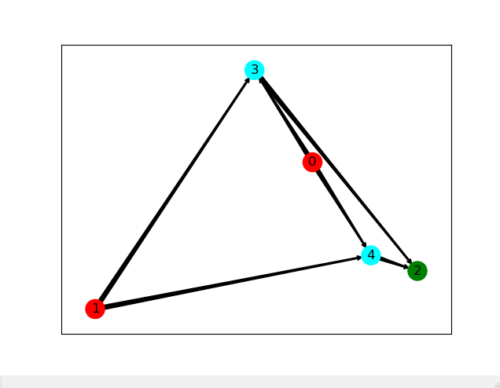
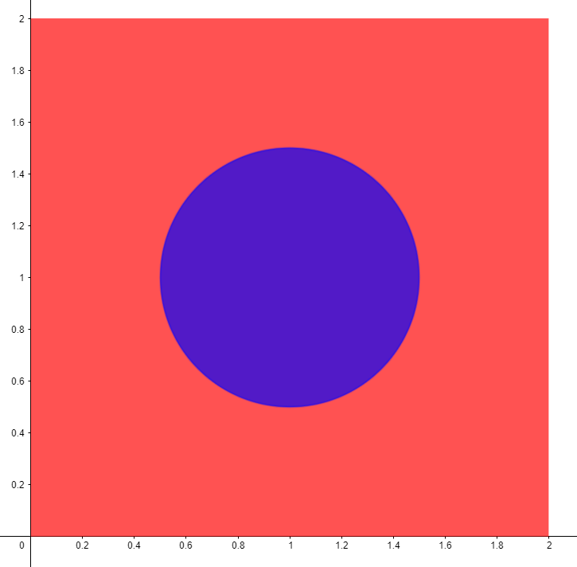
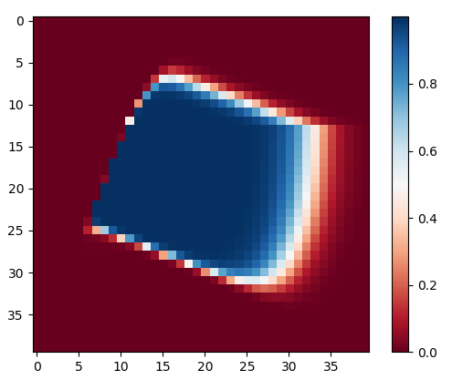

# PyNeuronalEvolution
Implémentation d'un structure de réseau de neurones optimisé par un algorithme génétique

# Introduction
Dans le cadre d'un autre projet [Slimes](https://github.com/Sup3Legacy/Slimes), j'ai envisagé la possibilité de simuler un arbre décisionnel par un réseau de neurones, optimisé par un algorithme génétique (comme les créatures qu'il doit équiper). Pour cela, j'ai créé en Python une structure de réseau de neurones compatible avec cet algorithme.

# Principe
Un réseau de neurones a, en pratique, une **structure fixe** et c'est les poids des connexions qui sont variables. Or la détermination de la structure optimale est un problème très difficile, qui ne connaît *a priori* pas de règle générale.

En permettant à un réseau de faire évoluer sa structure, on peut approcher au mieux la structure optimale adaptée à un probléme donné.

# Implémentation
Un réseau est représenté par un (ou plusieurs, selon le problème) neurone d'entrée et la même chose en sortie. Entre les deux, il y a une succession de "tranches". Des neurones peuvent apparaître sur les tranches et former des liaisons avec les neurones des autres tranches, toujours dans le sens **Entrée -> Sortie**, pour éviter les situations ou les connexiosn sont récursives, rendant le réseau imprévisible et instable.

L'algorithme procèdes par itération et à chaque itération, les réseaux sont combinés, mutés puis classés selon leur performance. Sont produits des réseaux de la forme : (La structure avec les tranches n'est pas apparente ici, les neurones sont placés aléatoirement par la fonction de dessin!) 

# Résultats
J'ai testé cet algorithme sur un problème simple : approcher le résultat de cette fonction (de **|R²** dans **|R**): 

J'ai obtenu, après un entraînement de 20 minutes, un réseau qui approche la fonction de façon convainquante : 

# Pistes pour le futur
J'ai obtenu de bons résultats à un problème simple mais il apparaît que cet algorithme est trop lent pour être utilisé en pratique sur des problèmes plus complexes.
